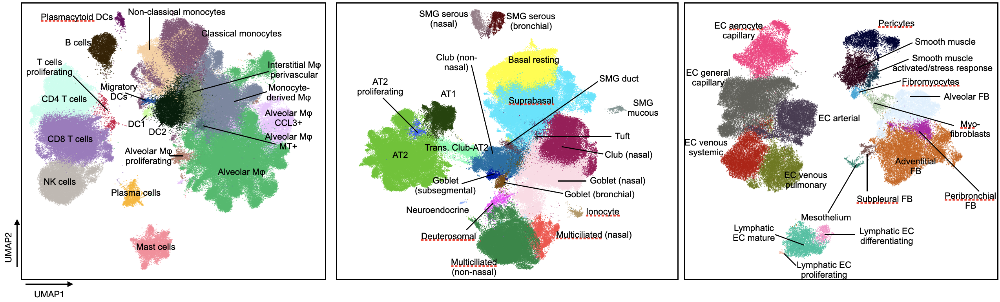

## [The integrated Human Lung Cell Atlas](https://www.biorxiv.org/content/10.1101/2022.03.10.483747v1)

Welcome to the github page of the intgrated Human Lung Cell Atlas (HLCA). Here, you will find:
* scripts to reproduce the analysis
* links to all places you can find, download, explore, and use the HLCA

## What is the HLCA?
If you're still wondering this, maybe check out the [paper](https://www.biorxiv.org/content/10.1101/2022.03.10.483747v1). In brief, it is the first integrated, universal transcriptomic reference of the human lung on the single-cell level.

## Why do we need the HLCA?
Over the past decade, numerous single-cell studies of the human lung have been published, yet each of these studies was limited in the number and diversity of individuals. However, a comprehensive reference should capture variation also across a diverse population. Moreover, querying individual studies simultaneously is complicated by different cell type definitions and batch effects. The HLCA overcomes these challenges by bringing together these single-cell and single-nucleus studies into a single atlas, combining samples from 444 individuals across 46 datasets. The core of this atlas, comprising healthy lung samples from 107 individuals, was fully re-annotated based on original annotations and annotations by 6 independent lung experts. This reannotation resulted in labeling of 58 different cell identity labels, thus proposing a first consensus annotation of the human lung.

 
*Figure 1. The cell annotations of the HLCA, split by cell type compartment.*
 
 

## What can we do with the HLCA?
The unprecedented number and diversity of human lung samples and cell types can be leveraged for a number of purposes. In the HLCA pre-print, we show that pooling these datasets enables better annotation of rare cell types. We moreover leverage the diversity in demographics of the atlas to model natural variation among healthy individuals, modeling the effects of sex, age, BMI, smoking, as well as changes with location in the nose and lungs. Using the HLCA cell type annotations, we link genomic variants of disease to specific cell types in the lung. Finally, we show that mapping new data to the HLCA core enables fast and accurate cell type annotation, as well as the identification of unknown cell identities, and disease-affected cell types.  
 
*Figure 2. Overview of the HLCA study.*
 
## How to use, explore and download the HLCA
If you would like to take a look at the HLCA, you can interactively explore it on two platforms. You can also download the HLCA there for your own use:  
- [cellxgene](https://cellxgene.cziscience.com/collections/6f6d381a-7701-4781-935c-db10d30de293) for exploration and download of the HLCA core.  
- [FASTGenomics](https://beta.fastgenomics.org/p/hlca)  for exploration and download of both the HLCA core and the full, extended HLCA. 

The file [HLCA_metadata_explanation.csv](./docs/HLCA_metadata_explanation.csv) in the docs folder of this repo contains a description of each metadata category that you'll find in the HLCA. 
## Map your own data to the HLCA:
If you would like to map your own data to the HLCA, for label transfer, identification of unknown and disease affected cell types there are multiple places to do that:   
- [The HLCA mapping GitHub repository](https://github.com/LungCellAtlas/mapping_data_to_the_HLCA) for bioinformaticians who want to map their data using scArches via a jupyter notebook  (including label transfer, uncertainty scores, and a low-dimensional embedding). 
- [FASTGenomics](https://beta.fastgenomics.org/analyses/detail-analysis-d85cb82af90d42bd9bc3086c1dc035c1#Result&scArches) for automated mapping with [scArches](https://www.nature.com/articles/s41587-021-01001-7) (including label transfer, uncertainty scores, and a low-dimensional embedding). 
- [Azimuth](https://app.azimuth.hubmapconsortium.org/app/human-lung-v2) for automated mapping with Azimuth (including label transfer and a UMAP visualization). 
- CellTypist for label transfer: coming soon.
- CZI reference mapping portal: coming soon. 

Note that the scArches mapping gives you an HLCA-informed low-dimensional embedding that you can use for downstream analyses, such as visualization (t-SNE, UMAP), clustering, and trajectory inference. 
Have fun!

### The HLCA paper:
Sikkema et al., bioRxiv 2022: https://www.biorxiv.org/content/10.1101/2022.03.10.483747v1

### Any questions?
Please submit an issue to this GitHub repository.
