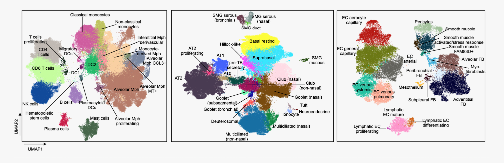

## [The Human Lung Cell Atlas](https://www.biorxiv.org/content/10.1101/2022.03.10.483747v1)

Welcome to the github page of the Human Lung Cell Atlas (HLCA). Here, you will find explanation about the HLCA, and links to all places you can find, download, explore, and use the HLCA

## What is the HLCA?
If you're still wondering this, maybe check out the [paper](https://www.biorxiv.org/content/10.1101/2022.03.10.483747v1). In brief, it is the first integrated, universal transcriptomic reference of the human lung at the single-cell level.

## Why do we need the HLCA?
Over the past decade, numerous single-cell studies of the human lung have been published, yet each of these studies was limited in the number and diversity of individuals, and are biased by their specific choice in technologies, protocols and more. A comprehensive reference should capture variation across a diverse population. Moreover, querying individual studies simultaneously is complicated by different cell type definitions. The HLCA overcomes these challenges by bringing together single-cell and single-nucleus studies into a single atlas, combining samples from 486 individuals across 49 datasets. The core of this atlas, comprising healthy lung samples from 107 individuals, was fully re-annotated based on original annotations and annotations by 6 independent lung experts. This reannotation resulted in labeling of 61 different cell identity labels, thus proposing a first consensus annotation of the human lung.

 
*Figure 1. The cell annotations of the HLCA, split by cell type compartment.*
 
 

## What can we do with the HLCA?
The unprecedented number and diversity of human lung samples and cell types in the HLCA can be leveraged for a number of purposes. In the HLCA publication, we show that pooling these datasets enables better annotation of rare cell types. We moreover leverage the diversity in demographics of the atlas to model natural variation among healthy individuals, modeling the effects of sex, age, BMI, smoking, as well as changes with location along the respiratory tract. Using the HLCA cell type annotations, we link genomic variants of disease to specific cell types in the lung. Finally, we show that mapping new data to the HLCA core enables fast and accurate cell type annotation, as well as the identification of unknown cell identities, and disease-affected cell types. Importantly, you can easily map your own data to the HLCA, as is described below under "map your own data to the HLCA".  

 
*Figure 2. Overview of the HLCA study.*
 
## How to use, explore and download the HLCA
If you would like to take a look at the HLCA, you can interactively explore it on CELLxGENE. There you can also download the HLCA for your own use:  
- [cellxgene](https://cellxgene.cziscience.com/collections/6f6d381a-7701-4781-935c-db10d30de293) for exploration and download of the HLCA core and the full HLCA, including both raw and normalized counts, as well as a batch-corrected embedding and UMAP visualization.  

The file [HLCA_metadata_explanation.csv](./docs/HLCA_metadata_explanation.csv) in the docs folder of this repo contains a description of each metadata category that you'll find in the HLCA.  
If you're interested in the code we used for the HLCA project, go check out the [HLCA reproducibility GitHub](https://github.com/LungCellAtlas/HLCA_reproducibility) containing all scripts and notebooks used for the HLCA project.  
If you would like to map your own data to the HLCA, see the section below. 
## Map your own data to the HLCA and/or perform HLCA-based label transfer:
If you would like to map your own data to the HLCA to obtain an atlas-based low-dimensional embedding (compatible with the atlas), and for label transfer and identification of unknown and disease affected cell types there are multiple places to do that:   
- [The Jupyter notebook tutorial](https://github.com/theislab/scarches/blob/hlca_tutorial_improvements/notebooks/hlca_map_classify.ipynb) of [scArches](https://www.nature.com/articles/s41587-021-01001-7) for mapping data to the HLCA (including label transfer and an atlas-based low-dimensional embedding). This approach was used and verified in the paper. 
- [FASTGenomics](link to follow once updated to HLCA v1.1). Same as above, but **automated** mapping via a web browser, see also [here](docs/fastgenomics-hlca-mapping.gif) for a short video demonstrating how to map your data. 
- [Azimuth, older HLCA version, to be updated](https://app.azimuth.hubmapconsortium.org/app/human-lung-v2) for automated mapping with Azimuth (including label transfer and a UMAP visualization). This approach was not used in the paper. 
- CZI reference mapping portal: coming soon. 

[The HLCA scANVI-based reference model](https://zenodo.org/record/7599104#.ZF5kPS8Rpqs) can be found on Zenodo 

For CellTypist-based label transfer (not used in the paper):
- [CellTypist for label transfer](https://www.celltypist.org/models), "Human_Lung_Atlas" reference.

Have fun!

### The HLCA paper:
Sikkema et al., bioRxiv 2022: https://www.biorxiv.org/content/10.1101/2022.03.10.483747v1

### Any questions?
Please submit an issue to this GitHub repository.
